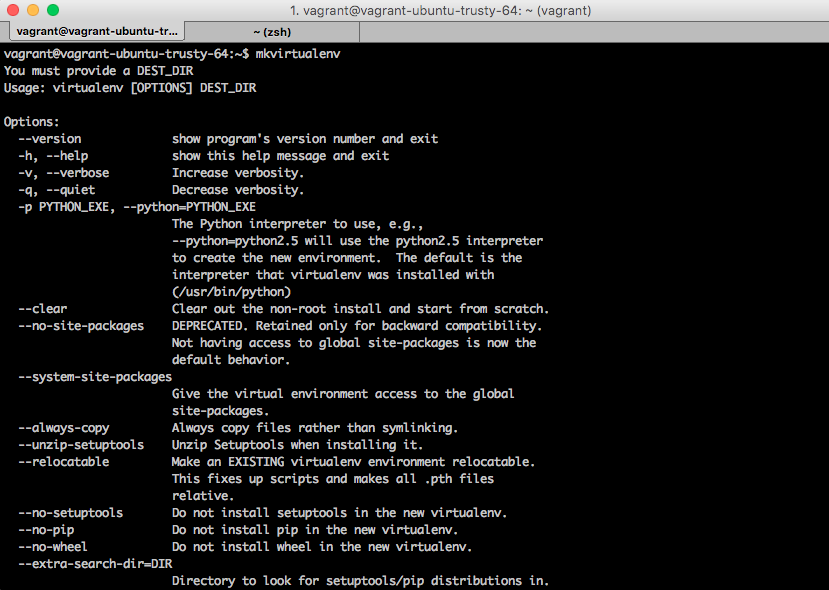

# Part 1

A Virtual Machine (VM) is software that allows you to run oher operating systems on your coputer in a separate window.  For example, your main machine is OSX, but you need to use Linux.  You can create a Virtual Machine and install Linux on it.  

Developers like to use VM's because they allow us to simulate production environments, save time when on boarding new developers and ensure consistency between environments. While VM's are super useful, they can be tricky to setup.  This is where Vagrant comes in.  Vagrant allows us to easily configure and manage our VM's.  Part 1 is going to show you how to setup a VM using Vagrant.

### Housekeeping

You are going to need to install the following before starting

*  <a href="https://www.vagrantup.com/downloads.html" target="_blank">Vagrant</a>
*  <a href="https://www.virtualbox.org/" target="_blank">VirtualBox</a>

> Discussion:  Why vagrant?  I build all my projects with Vagrant.  Using this setup, I am able to achieve a higher level of parity with my production environments and I can easily get technical and non-technical people alike ramped up on my projects quickly and easily.

### Step-By-Step

1. Create the folder where you want this project to live.  I am going to call mine `django-starter`

    `mkdir django_starter`

2. Move into `django_starter` 

    `cd django_starter`

3. Create your vagrant file

    `vagrant init`

    > `vagrant init` will create a new, relatively empty, file in your `django-starter` directory called `Vagrantfile`.  This is Vagrant's configuration file.

4. Now you can start to configure your Vagrantfile.  The first thing we will do is delete everything and add the following lines

        Vagrant.configure(2) do |config|
            # add configurations here
        end

5. Tell vagrant to install Ubuntu 14.04 in your VM

        # ...
        config.vm.box = "ubuntu/trusty64"

    > The `...` you see above is not meant to be typed into the `Vagrantfile`.  I use this ellipses to prompt you to write your code underneath the previous steps line of code.  So, at this point, your file will look like this:
        
        Vagrant.configure(2) do |config|
            config.vm.box = "ubuntu/trusty64"
        end

6. Tell vagrant the port you want to be able to acces your Django site on
    
        # ...
        config.vm.network "forwarded_port", guest: 8000, host: 8111,
            auto_correct: true

    > `autocorrect` is going to tell vagrant to choose another port if `8000` is already taken. This is a nice feature to have.  An alternative to this is to explicitly tell Vagrant what other ports to use.  This would look something like this
        
        config.vm.network "forwarded_port", guest: 8000, host: 8111,
        config.vm.network "forwarded_port", guest: 8001, host: 8110,

    I do not recommend this one because there are better solutions to this problem.  I go over some of them in my other starter templates.

7. Tell vagrant which folders to sync

        # ...
        config.vm.synced_folder ".", "/home/vagrant/django-starter"

    > This is going to sync everything inside of this directory into a 
    directory inside of your vagrant machine called `/home/vagrant/django-starter`.  

8. Enable SSH agent forwarding
        
        # ...
        config.ssh.forward_agent = true

    > Discussion:  What is SSH Agent Forwarding and is it necessary?  SSH keys are files that are used to tell other computers/services that you are who you say you are.  A real world example is seen when developers setup SSH keys <a href="https://help.github.com/articles/generating-an-ssh-key/" target="_blank">to get access to their Github account</a>.  What if you want to access your Github account with your vagrant machine?  Well, you would have to setup another SSH key, or you could tell you host machine to share it's SSH keys with your Vagrant machine.  That is what this config does.  Is it needed?  Nope.  I just like to have it.  Skip this step if you like, everything will be okay. 

9. Turn on your vagrant machine.  If this is the first time, it can take a little while.

    `vagrant up`    

9. While you wait for the above, this is a goods time to add a `.gitignore` to your project.

    `touch .gitignore`

    > Add the following to your `.gitignore`
        
        # virtual environments
        /.vagrant

    > Here you are telling git that you do not want to add the hidden vagrant machine files.  Please note that if you are using a different version control system, like Mercurial, you do not need to add this file.  For example, in the case of Mercurial, you would use a `.hgignore` file.  

10. Alright.  When your vagrant machine is setup, run the following command:

    `vagrant ssh`

    > This logs you into your VM's linux environment.

11. lets install some things that our project is going to need

    `sudo apt-get install -y python-pip`

    > The above is going to install 
    * python-pip - this is python's package manager
    The `-y` option tells Ubuntu's package manager that you are answering yes to everything.  If you did not add this, it would make you type `y` each time.  we are good with this install, so we will just use `-y`.

12. Install virtualenvwrapper

    `sudo pip install virtualenvwrapper`

    > Discussion:  What is Virtualenvwrapper.  Do I need it?  Virtualenvwrapper is a wrapper around Python's virtualenv tool.  Virtualenv is used to create isolated Python environments.  Virtualenvwrapper provides some great time saving shortcuts for virtualenv.  You definetley do not need to use virtualenvwrapper, but for developing this is something that I like to use.

13. Virtualenvwrapper requires some configuration - we can configure in the `.profile` file

    `vim ~/.profile`

    > Add the following lines to this file.  If this is your first time with vim, here are some basic commands:  1. i = interactive (lets you start typing) 2. navigate with the arrow keys. 3. When you are done adding things, tpye `:wq` (save and quit)

        # virtualenvwrapper configuration
        export WORKON_HOME="/home/vagrant/.virtualenvs"
        source /usr/local/bin/virtualenvwrapper.sh

    > Discussion:  What is the `.profile` file?  This is a settings file for your linux machine.  There is a much lengthier conversation to be had here, but for the time being, this will have to do.  Now, the lines you added tell Virtualenvwrapper that you want to store all your virtual machines in the `.virtualenvs` directory.  It also reloads the `virtualenwrapper.sh` file. 

14. Reload your `.profile` file

    `source ~/.profile`

15. Check if virtualenvwrapper is setup correctly.

    `mkvirtualenv`

    > You should get output in your terminal.  Now, for the time being we are not going to do anything with virtualenvwrapper
    
    . 

16. Create your virtualenvironment

    `mkvirtualenv taye_diggs`

    > `mkvirtualenv` is one of the time savings commands provided by virtualenvwrapper.  What it does it create a new virtalenv for you and in this case, we called it `taye_diggs`.  You can name it anything you like.  I called mine `taye_diggs` because In the next step, I will be creating a Django project called `taye_diggs`.  Now, for a normal project, I would name the Django project and then name my virtualenv after it.  I do this for consistency.  In this case we are going in reverse.  The reason is because I have not yet installed Django.  I do not want to install Django globally, so I have to do it in this order.
    
    > How do you know your virtualenv worked?  Next to your command prompt you will see (taye_diggs)

17. Install Django

    `pip install 'django>=1.9,<1.10'`

    > At the time of this writing, this will install Django 1.9.1

18. Create your Django project using the default Django `startproject` template.  Make sure that you run your command inside of `/home/vagrant/django-starter`

    `django-admin startproject taye_diggs`

    > If you did this correctly, your folder structure should now look like this

        .
        ├── Vagrantfile
        └── taye_diggs
            ├── manage.py
            └── taye_diggs
                ├── __init__.py
                ├── settings.py
                ├── urls.py
                └── wsgi.py

19. Build the database

    `python manage.py migrate`

20. Create a super user

    `python manage.py createsuperuser`

21. Start the Django dev server

    `python manage.py runserver 0.0.0.0:8000`

22. Now you can try to hit your Django site at localhost:8111

### Summary

This guide covered the following topics:

**Development Environment**

* Vagrant setup

