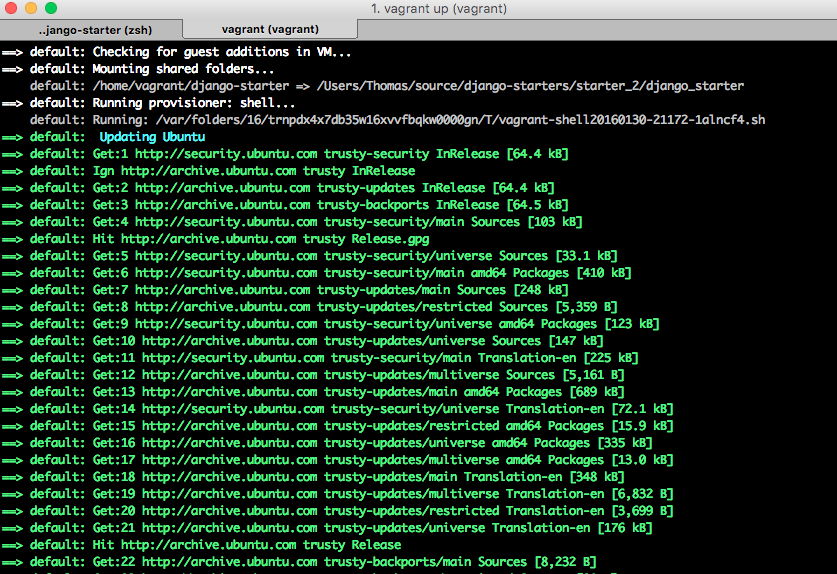

# Part 2

In `Part 1` we intialized a vagrant machine, installed and configued virtualenvwrapper in our VM and then setup our Django project.  If we wanted to start a new project we would have to go through all of those steps again.  That is a very manual process.  Instead, this starter is going to show you how to setup a provisioning script, which will be run by vagrant.  

By setting up a provisioning script we ensure that we do not have to repeat steps 12-22 from `Part 1`.  In addition, we remove several points of failure.  In other words, if done correctly automating allows us to avoid the opportunity to make mistakes.

### Housekeeping

This guide is going to introduce shell scripting.  Shell scripting is an amazing tool to have in your tool box.  I definetley recommend reading up on it before starting this section.  I have provided a great little resource below.  

[Guide to Shell Scripting](http://linuxcommand.org/writing_shell_scripts.php)

[Useful Bash Commands](https://help.ubuntu.com/community/Beginners/BashScripting)

We will run through the following steps in this guide:

* Setup your project directory
* Create + configure your Vagrantfile
* Create + configure your .gitignore
* Create your provisioning scripts
* Tell Vagrant to run your provisioning scripts

### Step-By-Step

If you started with `Part 1`, you can continue where you ended off with those.  If not, please create a directory called `django-starter` and add those files into this newly created directory.  Once completed, continue on with this guide.

We are going to run through the following steps in this guide:

1. Create the folder where you want this project to live.  I am going to call mine `django-starter`

    `mkdir django_starter`

2. Move into `django_starter` 

    `cd django_starter`

3. Create your vagrant file

    `vagrant init`

    > `vagrant init` will create a new, relatively empty, file in your `django-starter` directory called `Vagrantfile`.  This is Vagrant's configuration file.

4.  Create your `.gitignore` file

    `touch .gitignore`

5.  Inside of `.gitignore` add the following:

        # vagrant
        /.vagrant

6. Now you can start to configure your Vagrantfile.  The first thing we will do is delete everything and add the following lines

        Vagrant.configure(2) do |config|
            # add configurations here
        end

7. Tell vagrant to install Ubuntu 14.04 in your VM

        # ...
        config.vm.box = "ubuntu/trusty64"

    > The `...` you see above is not meant to be typed into the `Vagrantfile`.  I use this ellipses to prompt you to write your code underneath the previous steps line of code.  So, at this point, your file will look like this:
        
        Vagrant.configure(2) do |config|
            config.vm.box = "ubuntu/trusty64"
        end

8. Tell vagrant the port you want to be able to acces your Django site on
    
        # ...
        config.vm.network "forwarded_port", guest: 8000, host: 8111,
            auto_correct: true

    > `autocorrect` is going to tell vagrant to choose another port if `8000` is already taken. This is a nice feature to have.  An alternative to this is to explicitly tell Vagrant what other ports to use.  This would look something like this
        
        config.vm.network "forwarded_port", guest: 8000, host: 8111,
        config.vm.network "forwarded_port", guest: 8001, host: 8110,

    I do not recommend this one because there are better solutions to this problem.  I go over some of them in my other starter templates.

9. Tell vagrant which folders to sync

        # ...
        config.vm.synced_folder ".", "/home/vagrant/django_starter"

    > This is going to sync everything inside of this directory into a 
    directory inside of your vagrant machine called `/home/vagrant/django-starter`.  

10. Enable SSH agent forwarding
        
        # ...
        config.ssh.forward_agent = true

    > Discussion:  What is SSH Agent Forwarding and is it necessary?  SSH keys are files that are used to tell other computers/services that you are who you say you are.  A real world example is seen when developers setup SSH keys <a href="https://help.github.com/articles/generating-an-ssh-key/" target="_blank">to get access to their Github account</a>.  What if you want to access your Github account with your vagrant machine?  Well, you would have to setup another SSH key, or you could tell you host machine to share it's SSH keys with your Vagrant machine.  That is what this config does.  Is it needed?  Nope.  I just like to have it.  Skip this step if you like, everything will be okay. 

    > Up until this point, everything has been pretty much the same as `starter_1`.  Here is where we are going to start changing things up.

11. Create a new directory inside of `django_starter` called `vagrant` and also create your provisioning script

    `mkdir vagrant && touch vagrant/provision.sh`

    > We just created a script called `provision.sh`.  `provision.sh` is going to hold all of your shell scripts.   Keep in mind that you could call this file anything that you like.  I called it `provision` because this is a common practice and it also effectively tells other developers what this file does.  Clarity is king!

12. Open `provision.sh` in your text editor and type the following lines.  Remember to type out EVERYTHING...inlcusing the comment blocks.  Do not copy and paste ANYTHING.    

        #-------------------------------------------------------------
        # INSTALL SOFTWARE
        #-------------------------------------------------------------

        # INFO: update ubuntu
        echo -e "\e[1;36m Updating Ubuntu"
        sudo apt-get update

        # INFO: install pip
        echo -e "\e[1;36m installing pip"
        sudo apt-get install -y python-pip

        # INFO: install virtualenvwrapper
        echo -e "\e[1;36m installing virtualenvwrapper"
        sudo pip install virtualenvwrapper

        #-------------------------------------------------------------
        # CONFIGURE VIRTUALENVWRAPPER
        #-------------------------------------------------------------

        # INFO: configuring .profile
        echo -e "\e[1;36m configuring .profile"
        sed -i '10i# virtualenvwrapper configuration' /home/vagrant/.profile
        sed -i '11iexport WORKON_HOME="/home/vagrant/.virtualenvs"' /home/vagrant/.profile
        sed -i '12isource /usr/local/bin/virtualenvwrapper.sh' /home/vagrant/.profile

        # INFO: relaod .profile
        echo -e "\e[1;36m importing profile variables"
        source /home/vagrant/.profile

        #-------------------------------------------------------------
        # SETUP DJANGO
        #-------------------------------------------------------------

        # INFO: initialize virtualenvironment
        echo -e "\e[1;36m Creating project virtual environment..."
        mkvirtualenv zooey_deschanel

        # INFO: activate virtualenv
        echo -e "\e[1;36m Activate virtual environment"
        source /home/vagrant/.virtualenvs/zooey_deschanel/bin/activate

        # INFO: initialize virtualenvironment
        echo -e "\e[1;36m Installing Django"
        pip install 'django>=1.9,<1.10'

        # INFO: move into django project
        cd django_starter

        # INFO: initialize virtualenvironment
        echo -e "\e[1;36m Create django project layout zooey_deschanel"
        django-admin startproject zooey_deschanel

        # INFO: log user into virtualenv when they ssh into VM
        echo -e "\e[1;36m setting up bashrc"
        cat << EOF >> /home/vagrant/.bashrc
            # login to virtualenv
            source /home/vagrant/.virtualenvs/zooey_deschanel/bin/activate
            # project directory
            cd django_starter/zooey_deschanel
        EOF

        # INFO: move into django project
        cd zooey_deschanel

        # INFO: build initial Django DB tables
        echo -e "\e[1;36m migrating Django DB"
        python manage.py migrate

    > Discussion:  The above is the entire provisioning script.  I think it is important to type the above by hand. Further, it is also important to ask yourself what you are typing and why.  So you do not miss anything, here are a few questions that you should be able to answer at the end of this starter.  The point of this practice is to see how well you understand these concepts.  Remember, "If you can't explain it simply, you don't undertand it well enough" - Albert Einstein
    
    > * What does `-e` do?
    > * What does `\e[1;36m` do?
    > * What does `sed` do?  What is the -i option flag?  Is it required?
    > * Why do I have to `cd zooey_deschanel` before I run `python manage.py migrate`?
    > * BONUS:  What is the block of code starting with the comment `# INFO: log user into virtualenv when they ssh into VM`.
        
13. Now you have to tell Vagrant to run your provisioning script

        #...
        config.vm.provision "shell", path: "vagrant/provision.sh", 
            privileged: false

    > The above line tells vagrant that you want to use shell to provision.  It then specifies a path. This is the path to our `vagrant/provision.sh` shell script we just wrote.  We finally tell Vagrant to run as privileged false.  This means we do not want to run as the root user.  Thus, we are going to install everything as vagrants default `vagrant` user.  

14. Turn on your virtual machine

    `vagrant up`

    > You are going to notice that the output in your terminal is a little different this time.  It is going to start spitting out a lot of text.  It will look something like this.
    
    

    **NOTE:** If something goes wrong, read the error messages in your terminal.  Try to resolve the issue.  They are almost always very informative.  Once you make the changes you think will fix the problem, run `vagrant provision` which will tell vagrant to run your provision script again.  Once you resolve the issues, I would recommend `halting` your vagrant environment and then `detroying` it.  You can then run `vagrant up` again and test to make sure it still works.

15. Once your are finished with step 14.

    `vagrant ssh`

16. Start your Django dev server

    `python mananage.py runserver 0.0.0.0:8000`

You will now be able to hit your Django server at [http://localhost:8111](http://localhost:8111).

### Summary

This guide covered the following topics:

**Development Environment**

* Vagrant setup
* Provisioning

