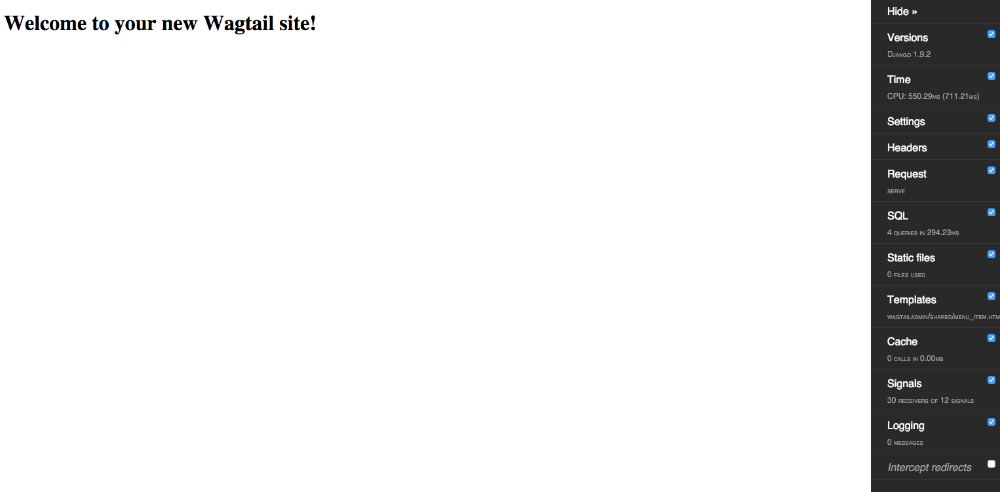

******
Part 1
******

`Wagtail`_ is a great Django CMS built by `Torchbox`_.  I use Wagtail for a lot of my projects which is why I wanted to write a `Cookiecutter` for it.  Wagtail actually has a really great example of `how to add wagtail`_ to your existing projects.  I will be doing something similar in this project, but instead of using the `startproject` django project, I will be using a more advanced Django template that I use as a starting point for my Django projects.

The goal is to illustrate one of the great features of Django Wagtail which is it's fllexibility and ease of use.  In this series, I am going to show you what it would look like to add wagtail to the advanced project layout from `django starter`_.

Housekeeping
============

Make sure you have the following installed before starting

* `Vagrant`_
* `VirtualBox`_
* `Git`_
* `Cookiecutter`_

.. epigraph::

   Discussion: Why vagrant? I build all my projects with Vagrant. Using this setup, I am able to achieve a higher level of parity with my production environments and I can easily get technical and non-technical people alike ramped up on my projects quickly and easily.

This guide will show you how to setup an existing project to use wagtail.  We are going to be configuring an existing cookiecutter template to  use wagtail.  However, these steps are the exact same for setting up an existing project with wagtail.  I will specify areas where your code might look different and I will also outline some extra steps that you would take.  More like reminders.  To get the files that I use in this directory, you can follow these steps:

1.  Clone `django-starter` into a new repo on your local

    .. code-block:: bash

        git clone https://github.com/tkjone/django-starter.git <new-directory>

Guide
=====

It's always helpful to see a before and after.  You just installed `django starter`_ cookiecutter template which is the basis for this project.  If you have used this setup before, then there is nothing new, but if you are new I recommend you run through the following steps to get a better understanding of what you are going to be doing.

1. Install Cookiecutter

   .. code-block:: bash

       // OSX
       brew install cookiecutter

       // OSX, Linux, Windows
       pip install cookiecutter

3. Scaffold your Django project using the `django starter` cookiecutter

   .. code-block:: bash

       cookiecutter https://github.com/tkjone/django-starter.git

   .. epigraph::

        You will be prompted to answer a few questions - prompts -  when you run this command.  Cookiecutter is going to use your answers to build and configure your Django project.  These are the answers that I provided:

        * repo_name: part_01
        * project_name: src
        * Select db_engine: 2

        Feel free to leave all the other questions blank (<enter>).

        **NOTE:** For those new to Cookiecutter, when you run the command from `step 2` Cookiecutter is going to build your project in whatever directory you are currently in.  Thus, for the time being, I recommend running the command in the directory where you want this project to live.

   .. image:: ../resources/images/cookiecutter_example.gif

   1. Make sure you are inside the root of your new Django project (same level as Vagrantfile)

   .. code-block:: bash

       vagrant up

   .. epigraph::

       If this is your first time running this command, it will take some time.  Vagrant has to download linux and provision your environment.

2. Login into your vagrant machine

   .. code-block:: bash

       vagrant ssh

3. Start your Django dev server

   .. code-block:: bash

       django-admin runserver 0.0.0.0:80000

   .. epigraph::

      `django-admin` is the equivalent to `python manage.py`.

After you run the command from `step 3` you should be able to hit your new Django site at `localhost:8111`_.  If successful, you will see the following screen:

   .. image:: ../resources/images/success-new-django-site.png

That is essentially the process, but now we want to make our project use wagtail.  To setup wagtail you will need to modify three files: 1.  settings.py and 2. urls.py and 3. requirements/base.txt.

.. epigraph::

   If you are modifying an existing project, you also need to make sure that your environment has the software dependencies to use PIL.  We will cover this later.

1. Settings File
++++++++++++++++

Our project layout is different because we split our ``settings.py`` file into three different files ``common.py``, ``dev.py`` and ``prod.py``.  The changes we want to add are site wide, regardless of dev or production environments, thus, we will setup wagtail inside of our ``common.py`` file.

At this point, all we are going to do is update the following ``common.py`` settings variables.  Some of these variables are Django's and other are introduced by Wagtail.  There are actually a lot of variables and I am not setting all of them because when I start my projects, I generally do not always need all of the settings wagtail offers.  What follows are the settings I almost always use.  For a more complete list, see `wagtail documentation`_

**DJANGO VARIABLES:**

* INSTALLED_APPS
* MIDDLEWARE

**WAGTAIL VARIABLES:**

* WAGTAIL_SITE_NAME
* WAGTAIL_ENABLE_UPDATE_CHECK
* TAGGIT_CASE_INSENSITIVE

Now  that we see all the variables, let's start updating our ``common.py`` file

1. Add Wagtail to your ``THIRD_PARTY_APPS``

   .. code-block:: python

        # before wagtail

        THIRD_PARTY_APPS = (
           # third paty apps here
        )

        # after wagtail

        THIRD_PARTY_APPS = (
           # wagtail dependencies
           'compressor',
           'taggit',
           'modelcluster',

           # wagtail
           'wagtail.wagtailcore',
           'wagtail.wagtailadmin',
           'wagtail.wagtaildocs',
           'wagtail.wagtailsnippets',
           'wagtail.wagtailusers',
           'wagtail.wagtailimages',
           'wagtail.wagtailembeds',
           'wagtail.wagtailsearch',
           'wagtail.wagtailsites',
           'wagtail.wagtailredirects',
           'wagtail.wagtailforms',
        )

   .. epigraph::

      Wagtail itself has dependencies which are compressor, taggit and modelcluster.

      * ``Compressor`` is for rendering Wagtail's admin front end files like css.
      * ``taggit`` allows us to the `taggit`_ django package.
      * ``modelcluster`` is a package developed by torchbox which enables wagtails `preview` feature.

      Descriptions of the above middleware can be found at `wagtail documentation`_

2. Add Wagtail to our ``MIDDLEWARE``

   .. code-block:: python

        # before wagtail

        MIDDLEWARE_CLASSES = [
            'django.middleware.security.SecurityMiddleware',
            'django.contrib.sessions.middleware.SessionMiddleware',
            'django.middleware.common.CommonMiddleware',
            'django.middleware.csrf.CsrfViewMiddleware',
            'django.contrib.auth.middleware.AuthenticationMiddleware',
            'django.contrib.auth.middleware.SessionAuthenticationMiddleware',
            'django.contrib.messages.middleware.MessageMiddleware',
            'django.middleware.clickjacking.XFrameOptionsMiddleware',
        ]

        # after wagtail

        MIDDLEWARE_CLASSES = [
            'django.middleware.security.SecurityMiddleware',
            'django.contrib.sessions.middleware.SessionMiddleware',
            'django.middleware.common.CommonMiddleware',
            'django.middleware.csrf.CsrfViewMiddleware',
            'django.contrib.auth.middleware.AuthenticationMiddleware',
            'django.contrib.auth.middleware.SessionAuthenticationMiddleware',
            'django.contrib.messages.middleware.MessageMiddleware',
            'django.middleware.clickjacking.XFrameOptionsMiddleware',

            # Wagtail Middleware
            'wagtail.wagtailcore.middleware.SiteMiddleware',
            'wagtail.wagtailredirects.middleware.RedirectMiddleware',
        ]

   .. epigraph::

       Descriptions of the above middleware can be found at `wagtail documentation`_

3.  Now we can add some new variables.  We are going to create a new section at the bottom of our ``common.py`` settings file that looks like this:

    .. code-block:: python

        # ------------------------------------------------------------------------------
        # WAGTAIL SETTINGS
        # ------------------------------------------------------------------------------

        WAGTAIL_SITE_NAME = '{{cookiecutter.repo_name}}'
        WAGTAILADMIN_NOTIFICATION_FROM_EMAIL = True
        TAGGIT_CASE_INSENSITIVE = True

    .. epigraph::

       Descriptions of the above middleware can be found at `wagtail documentation`_

That is everything required for Wagtail settings.

2. urls File
++++++++++++

1. Now we have to update our ``urls.py`` to start using wagtail search, admin and docs etc.  We will start by adding the required Wagtail imports to the top of our ``urls.py`` file.

   .. code-block:: python

       # before wagtail

       from django.conf.urls import include, url
       from django.contrib import admin

       # after wagtail (add these below the above)

       from django.http import HttpResponse

       from wagtail.wagtailcore import urls as wagtail_urls
       from wagtail.wagtailadmin import urls as wagtailadmin_urls
       from wagtail.wagtaildocs import urls as wagtaildocs_urls
       from wagtail.wagtailsearch import urls as wagtailsearch_urls

2. The next step is to update our urls.

   .. code-block:: python

       # before wagtail

       urlpatterns = [
           url(
               regex=r'^admin/',
               view=include(admin.site.urls)),

           url(
               regex=r'^$',
               view=TemplateView.as_view(template_name='base.html'),
               name="home"),
       ]

       # after wagtail

       # www.example.com/django-admin
       url(
           regex=r'^django-admin/',
           view=include(admin.site.urls)),
       # www.example.com/admin
       url(
           regex=r'^admin/',
           view=include(wagtailadmin_urls)),
       # www.example.com/search
       url(
           regex=r'^search/',
           view=include(wagtailsearch_urls)),
       # www.example.com/documents
       url(
           regex=r'^documents/',
           view=include(wagtaildocs_urls)),
       # www.example.com
       url(
           regex=r'',
           view=include(wagtail_urls)),
       # www.example.com/robots.txt
       url(
           regex=r'^robots.txt$',
           view=lambda r: HttpResponse("User-agent: *\nDisallow: /", content_type="text/plain")),

   .. epigraph::

       We entirely replaced the urls we add with the following:

       * www.example.com/django-admin - the admin that comes with django.
       * www.example.com/admin - wagtail's admin
       * www.example.com/search - Wagtail's buuilt in search
       * www.example.com/documents - Wagtail's documents endpoint
       * www.example.com - Wagtail's homepage
       * www.example.com/robots.txt - This is a simple robots.txt page.  Not a requirement.  There are also better ways of adding this.  For now, it's okay.

       You may also notice that we do not use the ``TemplateView`` import.  This is fine.  We have wagtail now to provide us with a temporary homepage.  Just remove it from your imports.

3.  Requirements/base.txt
+++++++++++++++++++++++++

This is the part where we actually install wagtail.  Add the wagtail dependency to ``requirements/base.txt``

.. code-block:: bash

    # ...
    wagtail>=1.3.1
    Pillow

At the time of this writing, 1.3.1 is latest.

That is everything that we need to do regarding the configuration of our Django project.  However, our current Ubuntu VM is missing some key packages that we need to run Wagtail.  So we are going to need to set that up

4. provision.sh
+++++++++++++++

We are going to need to have our provision script install some more packages for PIL which is an imaging tool.

.. code-block:: bash

    # before

    software=(
        "python-pip"
        "expect"
        "python-dev"
        "python3-dev"
        "postgresql"
        "postgresql-contrib"
        "libpq-dev"
    )

    # after

    software=(
        "python-pip"
        "expect"
        "python-dev"
        "python3-dev"
        "postgresql"
        "postgresql-contrib"
        "libpq-dev"
        "libjpeg-dev"
        "libtiff-dev"
        "zlib1g-dev"
        "libfreetype6-dev"
        "liblcms2-dev"
    )

.. epigraph::

    For people who are setting up their existing projects with Wagtail, you need to have the required software packages for your OS.  I develop on a Vagrant machine running linux, so my requirements are:

    * libjpeg-dev
    * libtiff-dev
    * zlib1g-dev
    * libfreetype6-dev
    * liblcms2-dev

    However, if you are running OSX or Windows your required dependencies will probably be different.

That is everything that we need.  We have now modified our previous cookiecutter to run wagtail.  Awesome.  To test this out, we are going to run `cookiecutter` on our new template.  This will produce all of out project files and then we can ``cd`` into our project directory and run the following commands.

1.  Turn on the vagrant machine

    `vagrant up`

2.  Login to the vagrant machine

    `vagrant ssh`

4. Turn on the Django dev server

    `django-admin runserver 0.0.0.0:8000`

When you hit our wagtail site we are going to see the following homepage:

That is all it takes to setup our Django project to use wagtail.

.. _Part 4: https://github.com/tkjone/django-starters/tree/django-starters-1.9.x/series_1/part_04
.. _Series 1: https://github.com/tkjone/django-starters/tree/django-starters-1.9.x/series_1
.. _git filter branch documentation: https://git-scm.com/docs/git-filter-branch
.. _Wagtail: https://wagtail.io/
.. _Torchbox: https://torchbox.com/
.. _how to add wagtail: http://docs.wagtail.io/en/v1.3.1/advanced_topics/settings.html
.. _django starter: https://github.com/tkjone/django-starter
.. _Vagrant: https://www.vagrantup.com/downloads.html
.. _VirtualBox: https://www.virtualbox.org/
.. _Git: https://git-scm.com/
.. _Cookiecutter: https://cookiecutter.readthedocs.org/en/latest/index.html
.. _localhost:8111: http://localhost:8111
.. _wagtail documentation: http://docs.wagtail.io/en/v1.3.1/advanced_topics/settings.html
.. _taggit: https://github.com/alex/django-taggit
