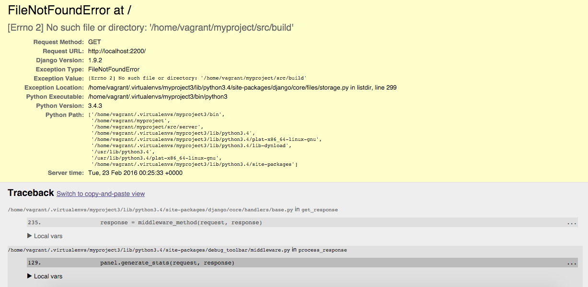

******
Part 2
******

This part of the series is going to introduce you to our Gulp setup.  I am not going to focus on explaining the basics of gulp, this is more of an advanced setup.  Don't worry though, gulp is pretty easy to understand. With that said, this guide will review the following:

* The tools directory layout
* gulpfile.js
* Creating our first task
* Tell Django where to find the CSS our Task Builds
* Require our task into the gulpfile.js
* How to use our task

The tools directory layout
--------------------------

At the start of this series, we created a new directory called ``tools``.  Our tools directory is currently empty.  Let's add a folder caled ``tasks`` and make it look like this:

.. code-block:: bash

    └── tools
        └── tasks

Gulp needs us to tell it what we want it to do.  By default, gulp will look for a ``gulpfile.js`` in the ``myproject`` root directory.  This file tells it what to do.

gulpfile.js
-----------

Create a ``gulpfile.js`` in your ``myproject`` root directory.  For the time being, we will leave it empty.

The next step is to create a task.

Creating our first task
-----------------------

Let's start by creating a file inside of ``tools/tasks`` called ``css.js``.  Our  ``tools`` directory structure looks like this:

.. code-block:: bash

    └── tools
        └── tasks
            └── css.js

Normally, all of our Gulp tasks would go in ``gulpfile.js``.  This can be a problem because eventually we are going to have a lot of tasks, and the ``gulpfile.js`` will become difficult to maintain.  To prevent this from happening we are going to split our tasks into individual files and ``require`` - *import* - them into our ``gulpfile.js``.

Let's start by building a simple task to illustrate how our setup is going to work.  The task we are going to make will be called ``css`` and the code will go into our newly created ``tasks/css.js`` file.  ``css`` is going to do three things:

* compile
* autoprefix
* csslint

I have chosen to use stylus as our css preprocessor for this example.  Thus, in order to do the above things, we are going to have to install the correct gulp packages.  Do the following:

.. code-block:: bash

     npm install --save-dev gulp gulp-autoprefixer gulp-csslint gulp-sourcemaps gulp-stylus

Once the above finishes installing, the code for our first task looks like this:

.. code-block:: javascript

    const gulp          = require('gulp');
    const stylus        = require('gulp-stylus');
    const sourcemaps    = require('gulp-sourcemaps');
    const autoprefixer  = require('gulp-autoprefixer');
    const csslint       = require('gulp-csslint');

    // -------------------------------------
    //   task: css
    // -------------------------------------
    module.exports = function () {
        gulp.task('css', function() {
            return gulp.src("./src/server/static/stylus/index.styl")
                .pipe(sourcemaps.init())
                .pipe(stylus())
                .pipe(autoprefixer())
                .pipe(csslint())
                .pipe(sourcemaps.write())
                .pipe(gulp.dest("./build/css/"))
        });
    }

In the above code we do three things:

1.  ``require`` the packages we want to use e.g. gulp, gulp-stylus etc
2.  Create our task, which we called ``css``, and put into inside the ``module.exports`` object.  This turns this piece of code into a module.  This will allow us to cleanly ``require`` it into our ``gulpfile.js``.  This is what allows us to easily split our gulp tasks so they all live in their own files.  In other words, when I ``require`` ``css.js`` into my ``gulpfile.js``, it is like I wrote it inside of the gulpfile.
3.  ``css`` is going to look for ``stylus`` files inside of ``server/static`` and it is going to return us vanilla css inside of a directory in our ``myproject`` root called ``build``.  This fodler is autogenerated by gulp, you don't have to create it yourself.

Because we are changing the location where we putting our CSS code, we need to tell Django about this.

Tell Django where to find the CSS our Task Builds
-------------------------------------------------

We told Django to look for static files at

.. code-block:: python

    STATICFILES_DIRS = (
        str(APP_DIR.path('server/static')),
    )

However, we now realize we are going to build our css, and other static resources, inside of a directory called ``build`` that will be autogenerated in our ``myproject`` root directory.  Lets fix the above to look like this

.. code-block:: python

    STATICFILES_DIRS = (
        str(ROOT_DIR.path('build')),
    )

.. note:: The above code lives in ``src/server/config/base.py``

Great.  Now we need to require our task into the ``gulpfile.js``

Require our task into the gulpfile.js
-------------------------------------

Go into ``gulpfile.js`` and add the following:

.. code-block:: javascript

    // plugins
    var gulp = module.exports = require('gulp');

    // tasks
    var tasksDir = './tools/tasks/';
    var tasks = [
        'css',
    ];

    // load tasks
    tasks.forEach(function(task) {
        require(tasksDir + task)();
    });

We have created the following variables.

gulp : variable
    Imports gulp

taskDir : variable
    The path to our tasks directory

tasks : variable
    The name of our tasks

We then loop over each task inside of the ``tasks`` array and ``require`` the tasks we want to use.  This is what we are doing if we did not have the loop:

.. code-block:: javascript

    require(./tools/tasks/css);

The above is the same as if we had written our code from ``css.js`` directly inside this file.  Alright, lets try it out!

How to use our task
-------------------

At this point we can use our task like we normally would.  Try to refresh your site now.  If you followed the above, you should get an error that looks like this:

Lets now run our gulp task.

.. code-block:: bash

    gulp css

You should now see your pretty pink website.  Now that we have our task built, we can move onto our next task:  BrowserSync!

