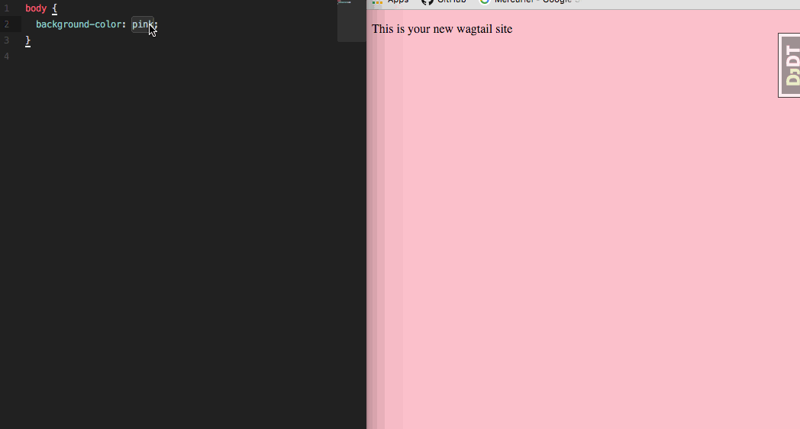
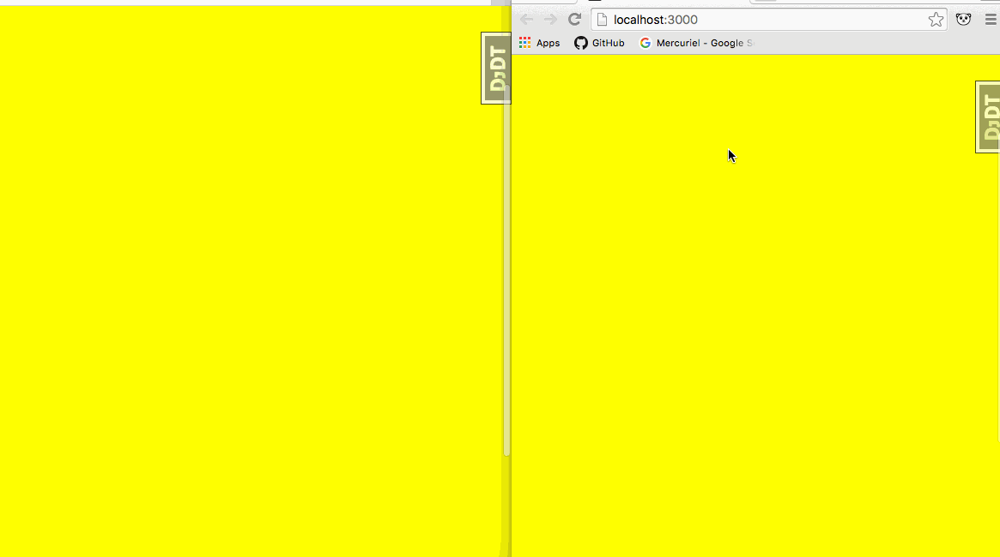

******
Part 3
******

This section is going to focus on creating your second task:  BrowserSync!  Some of the features it offers are live reloading, remote debugging and my favorite: interaction synchronization.  Don't worry if these features don't sound very special right now...this is one of those tools you just have to try for yourself.

This guide will walk through:

* Update the tools/tasks directory
* Create the BrowserSync task
* importing the task into our gulpfile.js
* using the browsersync

Update the tools/tasks directory
--------------------------------

To create this task we are going to do the exact same thing we did for our first task and create a task file.  We will call this task file ``browsersync.js``.  Thus, your ``tools`` directory will now look like this:

.. code-block:: bash

    └── tools
        └── tasks
            └── browsersync.js
            └── css.js

We can also take this opportunity to install ``browser-sync``

.. code-block:: bash

    npm install --save-dev browser-sync

Create the BrowserSync task
---------------------------

Inside of ``browsersync.js`` you are going to type out this code.

.. code-block:: javascript

    const gulp                 = require('gulp');
    const browsersync          = require('browser-sync').create('dev server');

    // -------------------------------------
    //   task: browsersync
    // -------------------------------------
    module.exports = function () {
        gulp.task('browsersync', function() {
            browsersync.init({
                proxy: {
                    target: "localhost:8111",
                },
            });

            // compile css
            gulp.watch('./src/server/static/stylus/**/*.styl', ['css']);

            // inject css into browsersync
            gulp.watch('./build/css/*.css', function() {
                gulp.src('./build/css/*.css')
                    .pipe(browsersync.stream());
            });
        });
    };

The above is a gulp task that is pretty much directly from the `BrowserSync + Gulp.js`_ documentation.  What is the following doing?  Lets break it down.

gulp : variable
    require gulp

browsersync : variable
    require browsersync, but we also create a server at the same time.  In this case we also named the server ``dev server`` - not required to name the server.

At a highlevel, this is what is happening.  When you run this task:

1.  Start a BrowserSync dev server that proxy's localhost:8111
2.  Run ``gulp watch`` on your stylus files.  If your stylus files change, it will run our ``css`` task
3.  Run ``gulp watch`` on your ``build`` directory.  If it see changes there, it is going to live inject the css changes into your local website.  In other words, you css will update without reloading the page.

Next step is we have to add it to our ``gulpfile.js``

Importing the task into our gulpfile.js
---------------------------------------

Similar to `Part 2`_ we have to tell our gulpfile about our ``browsersync`` task.  Lets update our ``gulpfile.js`` as follows:

.. code-block:: javascript

    // plugins
    var gulp = module.exports = require('gulp');
    var browserSync  = require("browser-sync");

    // tasks
    var tasksDir = './tools/tasks/';
    var tasks = [
        'css',
        'browsersync',
    ];

    // load tasks
    tasks.forEach(function(task) {
        require(tasksDir + task)();
    });

    // task: development
    gulp.task('development', ['browsersync'], function () {});

Lets go over the new parts in the above code:

1.  We import Browsersync
2.  We added the name ``browsersync`` to our ``tasks`` array.  This lets us import the ``browsersync`` task.
3.  We create a new task called ``development``.  This task is going to call browsersync.

.. note:: Why did we create the ``development`` task inside of the ``gulpfile.js`` when all the other tasks are on their own?  I like to think of this as a different type of task.  Each of the tasks in our ``tasks`` directory serve a very clear purpose - they try to do one thing and do it well.  We can then take these tasks and combine them.  I like to combine inside of the ``gulpfile.js``.  Further, this task is called ``development`` because when I run tasks, I like there to only be a handful - a ``development`` task, a ``production`` task and a ``tests`` task.  Also note that you can shorten this to ``dev``.  I named it ``development`` to be very clear on what it does.

Using the browsersync
---------------------

To use this task all you have to do is run

.. code-block:: bash

    gulp development

There will be a short pause and then your browser will auto launch and automatically hit browsersync at http://localhost:3000.  You can still hit your Django site at http://localhost:8111, but then you won't benefit from BrowserSync!  What are the benefits?  Lets try them out.

**live CSS Reloading**

Go your your ``stylus/index.styl`` file and change the color from ``pink`` to ``blue`` and then save the file.  It should look as follows:

**interaction synchronization**

I am simply showing two browsers synced - safari and chrome.  However, if you had this site loaded in firefox and your mobile device the interactions would be synced everywhere as you can see in the following gif.

**Remote Debugging**

This is a little more difficult to demo.  The best thing you can do is hit http://localhost:3001 and see what is there.

That is BrowserSync.  In the next series we will take this a step further and incorporate webpack into the mix.

.. _BrowserSync + Gulp.js: https://www.browsersync.io/docs/gulp/
.. _Part 2: http: google.ca

