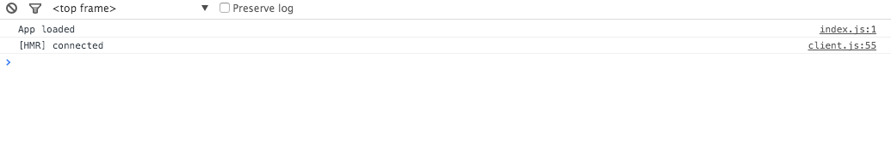

******
Part 4
******

In this section we are going to setup Webpack.  Webpack is a JS bundler, but it can do a lot more then that.  There are a lot of bundlers out there - `browserify`_, `webpack`_, `jspm`_, `rollup`_ - and I encourage you to do your research.  I enjoy webpack because it provides a huge amount of functionality, but I think the best part is support for all the major module types - AMD, COMMON, ES6 modules [1]_.  If you are a little confused by the options, check out some resources to get a clearer picture [2]_.

This section will review the following:

* The webpack setup
* Modify the tools directory
* Webpack configuration file
* Combining webpack and BrowserSync
* Working with webpack and browsersync
* Setup HMR For Webpack
* Webpack Serving Files

The Webpack Setup
-----------------

Webpack can be used by itself, with a built tool like Gulp, or added to other tools...like browsersync.  For our purposes ee are going to configure BrowserSync to use Webpack.

This works in the following way.  Webpack has middleware.  This middleware is what makes webpacks hotreloading and js bundling work.  So, if we add it to BrowserSync, which BrowsetSync is okay with because it let's you define custom middleware, we can get the best of BrowserSync and Webpack.  Like all of our other tools, we have to install webpack.

.. code-block:: bash

    npm install --save-dev webpack

I want to take this point to address webpack dev server (``WDS``).  This is essntially like browsersync.  ``WDS`` sets up a local sever and will do live reloading, static file injections etc.  What it does not do, at least not to my knowledge at the moment of writing this, is provide BrowserSync's interaction syncronization functionality or a nice little remote debug tool.  This is why I wanted to combine the two.

Okay, so how do we go about doing this?  The first thing is we need to do is create a  ``webpack.config.js``.

Modify the ``tools`` directory
------------------------------

The default naming convention for a webpack configuration file is ``webpack.config.js``.  Where does this file go?  Normally the ``webpack.config.js`` file is located in the root of your project.  I don't like this convention because I want to keep all the files and folders related to my projects tooling systems together.  Thus, lets modify the ``tools`` directory to look like this:

.. code-block:: bash

    └── tools
        └── configs
            └── webpack.config.js
        └── tasks

Anytime you have a configruation file related to front end tooling, we will store it in the ``tools/configs`` directory.  Now let's start editing the configuration file

Webpack configuration file
--------------------------

Why a ``webpack.config.js``?  Like the ``gulpfile.js``, there are a lot of settings that can be used to configure webpack and it can become a task to follow it.  The solution is to create a config file that holds all of webpacks configuration settings...much like django's ``config/base.py``.  So lets add the following to our ``webpack.config.js``.  Please note:  my setup is very specific to the middleware setup that I am using with browsersync.  This will not work for a more traditional browsersync setup.

.. code-block:: bash

    const path    = require('path');
    const webpack = require('webpack');

    const PATHS = {
      index: path.join(__dirname, '../../src/server/static/js/index.js'),
      build: path.join(__dirname, '../../build/js'),
      javascripts: path.join(__dirname, '../../src/server/static/js/'),
      styles: path.join(__dirname, '../../src/server/static/sylus/'),
    };

    module.exports = {
        devtool: "eval",

        entry: [
            'webpack-hot-middleware/client?path=/__webpack_hmr&timeout=20000',
            PATHS.index,
        ],

        output: {
            filename: 'bundle.js',
            path: PATHS.build,
            publicPath: 'http://localhost:3000/build/js',
        },

        plugins: [
            new webpack.optimize.OccurenceOrderPlugin(),
            new webpack.HotModuleReplacementPlugin(),
            new webpack.NoErrorsPlugin()
        ]
    }

.. note:: ``path``, which we require at the top of ``webpack.config.js`` also needs to be installed.

.. code-block:: bash

    npm install --save-dev path

path : package
    Easier way to build paths to files.  This is an NPM package.

webpack : package
    We are ``requiring`` webpack into our file

I will explain more about webpacks process a little later.

Combining webpack and BrowserSync
---------------------------------

Now that we have the settings for webpack in a config file we are going to tell browsersync to use webpack.  Go to our ``browsersync.js`` task.  Make it look like this:

.. code-block:: javascript

    const gulp                 = require('gulp');
    const browsersync          = require('browser-sync').create();
    const wpconfig             = require('../configs/webpack.config.js');
    const webpack              = require('webpack');
    const webpackDevMiddleware = require('webpack-dev-middleware');
    const webpackHotMiddleware = require('webpack-hot-middleware');
    const bundler              = webpack(wpconfig);

    // -------------------------------------
    //   Task: Browsersync
    // -------------------------------------
    module.exports = function () {
        gulp.task('browsersync', function() {
            browsersync.init({
                proxy: {
                    target: "localhost:8111",
                    middleware: [
                        // webpack-dev-middleware
                        webpackDevMiddleware(bundler, {
                            publicPath: wpconfig.output.publicPath,
                            stats: {
                                colors: true
                            },
                            headers: {
                                "X-Custom-Header": "yes"
                            },
                        }),

                        // compiler should be the same as above
                        webpackHotMiddleware(bundler),
                    ],
                },

            });

            // compile css
            gulp.watch('./static/**/*.styl', ['dev:css']);
            // inject css into browsersync
            gulp.watch('./build/*.css', function() {
                gulp.src('./build/*.css')
                    .pipe(browsersync.stream());
            });
        });
    };

The ``NEW`` comments are not to be in your code, they are to tell you what is new code.  We added new imports and browsersync ``middleware`` setting.

**New Imports**

As you can see browsersync has a bunch of dependencies.  We need to ``require`` webpack, webpack-dev-middleware, and webpack-hot-middleware and the webpack.config.js file.  If you are importing these, we also have to make sure you install them.

.. code-block:: bash

    npm install --save-dev webpack-dev-middleware, webpack-hot-middleware

**browsersync middleware setting**

BrowserSync has a ``middleware`` setting.  The first thing we do is call ``webpack-dev-middleware`` with two arguments: 1.  The ``webpack.config.js`` settings and 2. custom settings.  These custom settings are:

publicPath : path
    Where to find the files we are serving.

stats : object
    Colors true makes the terminal output colorful and pretty.

headers : object
    X-Custom-Header - custom headers

The second middleware we feed it is webpacks hotmiddleware.  The only argument we give this is our ``webpack.config.js`` settings file.

`Find more settings here`_

Now that we have that setup, lets try running it

Working with webpack and browsersync
------------------------------------

Notice that we added webpack to ``browsersync.js``?  This means that it is part of that task and we do not have to create a separate task, which means all we have to do is run our development task and everything should work (your Django server also has to be running)

.. code-block:: bash

    gulp development

Excellent.  If that worked you should see the following in your console:

There is an issue though.  If you use the setup as is, HMR will not work.

Setup HMR For Webpack
---------------------

HMR does not work unless you tell it too.  Thus, add the following to the end of your entry point file:

.. code-block:: bash

    if (module.hot) {
      module.hot.accept();
    }

Now when you change the console log and save the file, the page will reload without refreshing.  No, if you are doing things with side effects - like changing the DOM, you have to add a differnt piece of code.  This other piece of code is better descibed in `Webpack HMR Tutorial`_ and `Understanding Webpack HMR`_.

Webpack Serving Files
---------------------

Note that webpack does not actually build files to the ``build`` directory.  It stores the builds in memory, which is nice for development.

In the next section we will explore adding ES6 to webpack.

.. [1] Addy Osmani has a very good article about the different types of JS modules

    * `writing modular js`_

.. [2] some website talking about bundlers

    * `browserify v webpack`_

.. _browserify: http://browserify.org/
.. _webpack: https://webpack.github.io/
.. _jspm: http://jspm.io/
.. _rollup: http://rollupjs.org/
.. _browserify v webpack: https://medium.com/@housecor/browserify-vs-webpack-b3d7ca08a0a9#.g2ifjuu76
.. _writing modular js:  https://addyosmani.com/writing-modular-js/
.. _Find more settings here: https://github.com/webpack/webpack-dev-middleware
.. _Webpack HMR Tutorial: http://andrewhfarmer.com/webpack-hmr-tutorial/
.. _Understanding Webpack HMR: http://andrewhfarmer.com/understanding-hmr/

