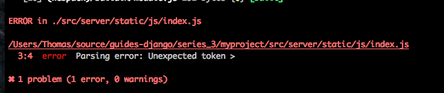

******
Part 6
******

Now that we can code any kind of Javascript we like, we should make sure that we are writing well.  One way of checking for this is to configure webpack to lint our JS before we even pass it to webpack.  Thus, this section is going to cover setting up

* eslint requirements
* configuring webpack.config.js
* configuring eslint
* running some test code

eslint requirements
-------------------

`eslint`_ has quickly become one of the best linting libraries for JS.  One of the reasons it has been so well recieved is because of it's customizability.  In order to use it we first have to install it.

.. code-block:: bash

    npm install eslint eslint-loader babel-eslint eslint-config-airbnb  --save-dev

The above packages do the following:

eslint : package
    This is the eslint package.  Webpack or no, you have to install this.

eslint-loader : package
    This allows us to use eslint with webpack.  Only needed if using webpack

babel-eslint : package
    This is a parser based on babel

eslint-config-airbnb : classifier
    This is airbnb's linting configurations.  I recommend this to start because ait bnb provides a `well layed out guideline`_ for javascript.  This is optional.

configuring webpack.config.js
-----------------------------

All we have to do is configure our ``webpack.config.js`` to use eslint.  We are using a preloader.  This means that eslint will happen before it hit babel.  Here is the code you will add underneath the ``loaders`` property:

.. code-block:: javascript

    preLoaders: [
        {
            test: /\.js$/,
            loader: "eslint-loader",
            include: PATHS.javascripts,
        }
    ],

The above does the following:

test : setting
    Run ``eslint`` against files that match ``js``.

loader : setting
    Use the eslint loader.

include : setting
    Look for JS files in the ``PATHS.javascripts`` directory.

configuring eslint
------------------

It should be very clear by now that almost all software we use has the potential to use a configuration file.  eslint is no different.  eslint uses the naming convention of ``.eslintrc`` for their configuratio file. Lets create an ``.eslintrc`` file inside of our ``tools/configs`` directory.

Here is what you will put inside of the ``eslintrc`` file.

.. code-block:: javascript

    {
        "extends": "airbnb",
        "parser": "babel-eslint",

        "env": {
            "browser": true,
            "node": true,
            "es6": true
        },
    }

Each one of the above settings can be reviewed in the `eslint documentation`_.

.. _eslint: http://eslint.org/
.. _well layed out guideline: https://github.com/airbnb/javascript
.. _eslint documentation: http://eslint.org/docs/user-guide/configuring

cleaning up our files by building a gulpfile.js config file and multiple webpack.config.js files.

running some test code
----------------------

That is everything we need, now you can run ``gulp development`` and everything should run correctly.  If you were following along with this code you will get an error that looks like this:

No worries, this means that ``eslint`` is doing it's job and letting us know that something went wrong.  Based on this error, eslint does not like our ``arrow`` function.  Now this is ES6 code, but we should be able to handle that just fine.  This is a case where I encourage you to try to debug before you read the next paragraph.

Figure it out?  The issue is with our ``webpack.config.js``, specifically, eslint does not see our ``.eslintrc`` file so it does know how to handle it.  This is resolved by adding the following line under the ``eval`` property in ``webpack.config.js``.

.. code-block:: bash

    eslint: {
        configFile: "./tools/configs/.eslintrc"
    },

Cools.  That is just about everything.  We have successfully connected ESLINT to webpack and we are now validating for code quality.

production builds

cleaning up our gulpfile and more config settings