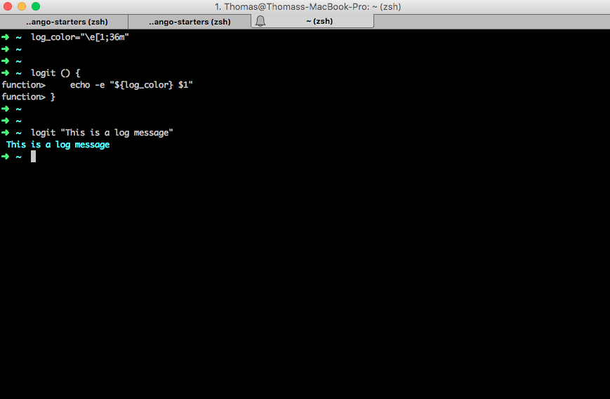

# Starter 3

We are going to start where we left off with `starter_2`.  We now have a provisioning script that allows to us to start a VM, setup virtualenvwrapper and initialize a Django project.  Now, you might be thinking, great, I have a provisioning script.  But what if I want to start a new project using `starter_1` or `starter_2`?  Wouldn't I have to go into each one and change the project names and adjust the provisioning script?  Yeah, you would and given the state of our current provisioning script that will be a tedious and error prone process.  That is what this starter is going to cover: making our provisioning script a little smarter

`Starter_3` is going to go through the provisioning script and clean it up so that it is is more reusable.

### Housekeeping

As I look over our `provision.sh` file from `starter_2` I see a few items that would cause us problems.  For example, if I want to start a new project with this script, I would have to change lines 37, 41, 51, 52, 58, 60 64. We also have some other challenges:  What if I want my INFO logs to be more informative?  lines 36, 51.  What if we have considerably more packages to install? Do I have to tpye out `sudo apt-get install <package>` each time?  Even the INFO logs themselves are clunky.  Each time I have to write out `echo -e` and `\e[1;36m`.  Maybe there is a cleaner way to do this?

In this step-by-step we are going to add the following:

* Two new sections:  Utlities & Configs
* Build our first utlity function - a logging function
* Create config variables for common values

### Step-By-Step

1.  At the top of `provision.sh` lets add the following lines.  Remember to type it out.

        #-------------------------------------------------------------
        # CONFIGS
        #-------------------------------------------------------------

        log_color="\e[1;36m"

        #-------------------------------------------------------------
        # UTILITIES
        #-------------------------------------------------------------

        #    SUMMARY:  Logging Utility
        #    EXAMPLE:  logit "This is a console log"
        #    PARAMETERS:
        #       MSG - enter a string that you want logit to log
        logit () {
            echo -e "${log_color} $1"
        }`

    > Discussion.  We created our first color called `log_color` and assigned it the value that we had to manually type out: `\e[1;36m`.  In other words, we are saying that log_color is cyan.  We then create our first shell utilites function called `logit`.  We add a $1 inside of quotes which tells it to take 1 parameter.  In this case, the parameter is a string.  You can actually take these and put them in your console to test them out:
    
    

2. Now you are going to go through your `provision.sh` script and substitute everything that looks like `echo -e "\e[1;36m ..."` with our new logit function and make it look like this:

        logit "<insert message here>"

3. Inside of the Configs section create a few more variables.

        # ...
        repo_name="django_starter"
        project_name="zooey_deschanel"
        virtualenv_dir="/home/vagrant/.virtualenvs"

4. Using those variables you just created, You can configure your `provision.sh` to look like mine.  Please note the difference between the `repo` and the `projects` variables as these are easy to misconfigure and a pain to debug.  Below, I specify which files should be changed and how:

        mkvirtualenv ${repo_name}

        source ${virtualenv_dir}/${project_name}/bin/activate

        source ${virtualenv_dir}/${repo_name}/bin/activate

        source ${virtualenv_dir}/${project_name}/bin/activate

        source ${virtualenv_dir}/${repo_name}/bin/activate

5. Find all instance of `/home/vagrant/.virtualenvs` and replace with `${virtualenv_dir}`.  The exception to this is the line `sed -i '11i export WORKON_HOME=/home/vagrant/.virtualenvs' /home/vagrant/.profile`.  Leave that one as is for now.  If you get a little lost, please refer to the `provision.sh` script inside of this folder.

At this point, that should be everything. So what did we do?  By going through the provision script and making it smarter we made it so that we can now use this `starter_3` as a full fledged starting point for Django.  Everytime we want to spin up a django development evironment all we have to do is use the folder structure in this project, go into the `provisionscript` and change the config variables.  We will also need to go to the `Vagrantfile` and change the line that says `config.vm.synced_folder ".", "/home/vagrant/django_starter"` and change `django_starter` to whatever your repo name is.  That is now considerably less work that needs to be done, but at the same time, couldn't we just set it up so we could manage our projects configurations from just one file?

Yes.  In `starter_4` we will introduce `cookiecutter` and show you how to begin truly templating your projects.

