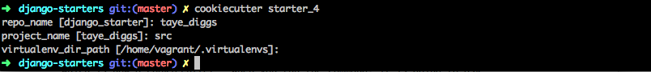

# Starter 4

We left off `starter_3` with a starter project template that could be configured in a more manageable way.  This starter will introduce cookiecutter into the equation and show you how you can create robust and complex templates that will be configured through one interactive terminal session.  

# HOUSEKEEPING

Cookiecutter is a commandline tool that creates completley configured projects from cookiecutters.  Now, before you can use this tool you have to do a little setup.  Because we are familiar with our current starter setup, we will make the `starter_3` project a cookiecutter.  

The first thing we need to do is install cookiecutter.

**OSX:**

`brew install cookiecutter`

**LINUX:**

`pip install cookiecutter`

> see <a href="https://cookiecutter.readthedocs.org/en/latest/installation.html" target="_target">Cookiecutter Official Docs</a> for more information.

You first create a cookiecutter.  Each one of the starters in this project is capable of becoming a cookiecutter.  The only thing remaining is to configure them to be used by cookiecutter.  Until I have time to write a better outline of what cookiecutters are, I highly recommend reading <a href="http://www.pydanny.com/cookie-project-templates-made-easy.html" target="_target">Cookiecutter: Project Templates Made Easy</a>.

# Step-by-step

1.  Create your project folder, as always, mine is called `starter_4`

    mkdir `starter_4`

2.  Change directory so you are inside of `starter_4`

    `cd starter_4` 

3.  Create a cookiecutter configuration file

    `touch cookiecutter.json`

    > When you run cookiecutter it is going to ask you questions.  Those questions are defined in the `cookiecutter.json` file.  

4.  Lets tell cookiecutter to ask us some questions so it can configure our projects for us.

        {
            "repo_name": "taye_diggs",
            "project_name": "src",
            "virtualenv_dir_path": "/home/vagrant/.virtualenvs"
        }

    > Questions are key, value pairs.  The keys are the question that you are telling cookiecutter to ask.  The value is the default value.  The defualt value is only used when you leave the question blank.  More on this later.

    > Notice anything about the above questions?  At the end of `starter_3` I told you that if you would like to create a new project using `starter_3` as your template, you would have to change two files:
    1.  **provision.sh** - you have to specify the following variables `repo_name`, `proejct_name`, `virtualenv_dir`.
    2.  **Vagrantfile** - you have to change the `django_starter` part of `config.vm.synced_folder ".", "/home/vagrant/django_starter"` to the repo name your new project requires.  

    > Keep the above in mind for the next step.

5.  Before we continue setting up our cookiecutter, I want to review our cookiecutter questions.  For example, What is the difference between a `repo_name` and a `project_name`?  Take a look at the following structure.

        └── django_starter
                ├── taye_diggs 
                ├── Vagrantfile
                └── vagrant
                    └── provision.sh

    > `django_starter` = {{cookiecutter.repo_name}}

    > `taye_diggs` = {{cookiecutter.project_name}} 

    > In the above, all of the code required to develop our project lives in `django_starter`.  That makes it the repo.  Inside of `django_starter` we have the subdirectory `taye_diggs`.  All of our Django code lives in `taye_diggs`.  Now, I believe this can be a little confusing.  Consider the following: someone new to the project is looking for the projects source code, the code that runs the project, they would have to look through all of the `django_starters` sub-directories till they found it.  To clear up this confusion I like to name my `repo_name` something creative and unique to the project.  I then name the Django directory `src`.  Thus, my projects would look like this:

        └── taye_diggs
                ├── src
                ├── Vagrantfile
                └── vagrant
                    └── provision.sh        

    > As you can see, `django_starter` became `taye_diggs` and I changed the `taye_diggs` sub directory to be `src`.

6. With the questions we want to ask specified in our `cookiecutter.json` we can now go through our template and tell cookiecutter to take the answers we gave and populate them in different parts of our template.  Lets start by creating our repo.

    `mkdir {{ cookiecutter.repo_name }}`

7.  Inside of `{{ cookiecutter.repo_name }}` lets add our `Vagrantfile` and `vagrant` directory that we used in `starter_3`.  You can copy these files over if you like, since at this point you have already typed them once.  When done you should have a cookiecutter structure that looks like this:

        ├── starter_4
        │   ├── README.md
        │   ├── cookiecutter.json
        │   └── {{cookiecutter.repo_name}}
        │       ├── Vagrantfile
        │       └── vagrant

    >  **NOTE:**  where I put `starter_4`, you would have the name of your directory.  The important part to know is that the structure inside of your project matches mine above.  
    >  Why did we name our directory `{{cookiecutter.repo_name}}`?  We did this because it represents our repo, and the name of our repo is probably going to change from project to project.
 
8.  Now tell Cookiecutter to configure your `Vagrantfile`

        // Vagrantfile
        config.vm.synced_folder ".", "/home/vagrant/{{cookiecutter.repo_name}}"

    > Previously, this line used to look like this:  `config.vm.synced_folder ".", "/home/vagrant/django_starter"`.  Where `django_starter` represents the name of your repo.

9.  Now we are going to go into `vagrant/provision.sh` and change our `configs` section.  Change it so it looks like the following:

        // provisions.sh
        repo_name="{{ cookiecutter.repo_name }}"
        project_name="{{ cookiecutter.project_name }}"
        virtualenv_dir="{{ cookiecutter.virtualenv_dir_path }}"

10.  Cool, that should be everything.  Okay.  Lets see if this worked.  Go into your terminal and run the following command:

        `cookiecutter starter_4`

    > This will tell cookiecutter to generate a project based on `starter_4`, which is now a cookiecutter!  When you run the command, it is going to ask you all the questions you specified and use them to generate your template. 
    
    

    The above will output the following directory structure:

        └── taye_diggs
            ├── Vagrantfile
            └── vagrant
                └── provision.sh

    If you look inside your `provision script` you will see this:

            repo_name="taye_diggs"
            project_name="src"
            virtualenv_dir="/home/vagrant/.virtualenvs"

    Pretty neat, huh?

7.  Now all thats left to do is turn on your vagrant machine.

    `vagrant up`

With this completed we come to the end of the first part of our django-starts series which show you how to setup a bare minimum Vagrant environment + Django project + cookiecutter.  You can now use starter_4 as a cookiecutter for al of your Django projects if you like.  However, in reality, this is a little far from what we truly want, which is something that allows us to start developing right away.  So in `starter_5` we are going to begin focusing on Django and seeing how we can improve our Django template.
