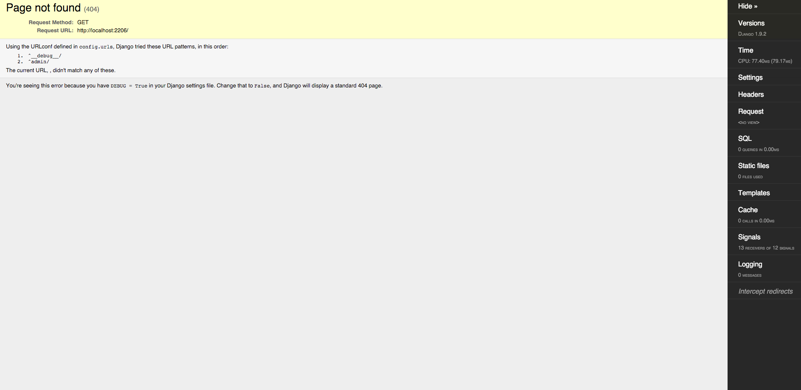

# Starter 6

This is where we are going to start customizing our Django project layout.  We started this process in `starter_5` when we changed the name of the `src` directory to `config`.  Otherwise, all we did was use the layout generated with the `startproject` command and turn it into a cookiecutter. While we could still use `starter_5` as a starting point, the project layout still leaves us wanting. The problems will come when you begin developing more complex Django applications.  What will happen is that as the project scales that layout is going to quickly become unmaintainable.

This guide will present a good way to go about customizing the project layout.  Specifically, we are going to focus on the settings file and do two things: 

1. Implement environment variables
2. Add some additional settings
2. Split our settings.py into three settings files - `common`, `dev`, `prod`

### HOUSEKEEPING

We will start by getting you setup with the correct project structure.  I think the best thing to do is get the `starter_5` cookiecutter.  If you are just starting this series, here is a quick way to get it.  

1.  Clone `django-starter` into a new repo on your local

    `git clone https://github.com/tkjone/django-starters.git <new-directory>`

2.  `cd` into `<new-directory>`

3.  Make the `starter_5` template the HEAD
    
    `git filter-branch --subdirectory-filter starter_5 HEAD-- --all`

4.  Cleanup your new git repository

    `git gc --aggressive`
    
    `git prune`

5.  Change your git remote settings

    `git remote update origin <your-repository-url-here>`


    > **DISCUSSION:**  The above is a nice way of turning a subdirectory into a repository of it's own.  For more info see [git filter-branch documentation](https://git-scm.com/docs/git-filter-branch).  Please also note that `<new-directory>` is me telling you to give the directory a name, it's not the name of the directory.  

When everything is done you will have the following project structure. 

```
.
├── README.md
├── cookiecutter.json
└── {{cookiecutter.repo_name}}
    ├── Vagrantfile
    ├── vagrant
    │   └── provision.sh
    └── {{cookiecutter.project_name}}
        ├── config
        │   ├── __init__.py
        │   ├── settings.py
        │   ├── urls.py
        │   └── wsgi.py
        └── manage.py
```

Alright, lets start modifying the template.

### BACKGROUND

The first step I want to take is to define the encoding of our Python source files.  For all the files we have within the config directory we can add the following line to the top of the directory:

`# -*- coding: utf-8 -*-`

> **DISCUSSION:**  For more information on this read about [python encoding](https://www.python.org/dev/peps/pep-0263/).  

Now we can begin mofifying our settings file.  When you spin up a new Django project using `startproject` you get a file called `settings.py`.  This file holds your projects configuration settings.  For example, this file holds variables that tell Django where to find things like your static files, templates, or the database you are using.  These settings are loaded when you start your server, thus, everytime you run `python manage.py runserver` your settings files get loaded.  If you make a change to the settings files, you need to reload the server.  As we can see `settings.py` is important.  Where things become challenging is when you need different settings for different environments.

The most common types of development environments are `dev` and `production`.  In more complex environemts, you can have even more environments like `staging`, `qa`, `testing` etc.  The point?  `production` is going to have different variables compared to `dev`.  Further, it might have differnt settings entirely depending on the tools required for production, but not required in development.  Fortunatley for us, the solution is not too complicated - `environment variables` and `multiple settings` files.

This idea is inspired by the principles outlined in [12 factor app](http://12factor.net/config).  The idea is that we set `environment variables`, which are set and stored in one location, and we tell our settings files where to find those variables.  This is step one and resolves the issue of having to go in our settings file and change it multiple times.  It also means that we can version control our settings files and never have to configure it unless we are adding something to it.  Does this remind you of something?  Yep, this is exactly what we did in our `provision.sh` in `starter_3` where we defined a section at the top of the file to hold our `configs`.  It's also the same thing that `cookiecutter` does when you set a `cookiecutter.json` and the rest of the files don't need to be changed.  Same difference.

While the environment variables solve the issue of having to change values in our settings files, we still need to have a solution when our settings file needs a completley different tool configuration in `prod` v. `dev`, or visa-versa.  One of the accepted answers here is `multiple configuration` files.  Thus, we create a `common`, `dev` and `prod` settings files.  This allows other developers to easily know what settings are used in each environment and where to find them. 

Now that we have a little understand, lets go ahead and start fixing our settings file to use environment variables and then we will split it into multiple files.

> **DISCUSSION:** I want to note at this point that we are going to be using `django-environ` to help us with the environment variables.  We do not actually need this, but I like it becasuse it provides a bunch of nice helpers and makes our code read better.  

Because we are working with `django-environ` we should also take this moment to add a `requirements` directory and add `django-environ` to the files.

1.  Add a `requirements` directory to `{{cookiecutter.repo_name}}`

    `cd {{cookiecutter.repo_name}}`
    `mkdir requirements && touch requirements/base.txt`

    > **Discussion:** the `requirements` directory holds the django dependencies required for your projects.  If you are familiar with node, this would be similar the the `package.json`

2.  Update your `requirements/base.txt`

        `django-environ`

    > **DISCUSSION:**  Django-environ is a great tool that allows you to easily achieve 12 factor app inspired environment variables.  The idea is that we create a file that is not committed to git.  Inside of this file are variables like the name of your database and the password.  We then setup the `settings.py` to make use of them.  This means that we can commit our settings file and we never have to make changes directly to this file.  All we have to do is set environment variables.  

### STEP-BY-STEP

The first thing I want to do is make our current settings file read better.  Let's divide it into sections, much like we did for our `provision.sh` file.  For the settings file as it is, we are going to divide it into 8 sections:

* apps
* middleware
* debug
* secret
* database
* general
* template
* static
* other

The order of the above does not matter so much, you can follow the one I have in my settings file, or define your own.  Further, feel free to add more sections if you like.  The goal with these block, as I mentioned earlier, is it makes the sections more readable and organized.  To see an example, this is what your settings file will look like sectioned off.  

```
   # -*- coding: utf-8 -*-
   """
   Django settings for {{ cookiecutter.project_name }} project.

   Generated by 'django-admin startproject' using Django 1.8.4.

   For more information on this file, see
   https://docs.djangoproject.com/en/1.8/topics/settings/

   For the full list of settings and their values, see
   https://docs.djangoproject.com/en/1.8/ref/settings/
   """

   import os

   # ------------------------------------------------------------------------------
   # APP CONFIGURATION
   # ------------------------------------------------------------------------------

   DJANGO_APPS = (
   'django.contrib.admin',
   'django.contrib.auth',
   'django.contrib.contenttypes',
   'django.contrib.sessions',
   'django.contrib.messages',
   'django.contrib.staticfiles',
   )
   THIRD_PARTY_APPS = (
   #third paty apps here
   )
   LOCAL_APPS = (
   #local apps here
   )

   # See: https://docs.djangoproject.com/en/dev/ref/settings/#installed-apps
   INSTALLED_APPS = DJANGO_APPS + THIRD_PARTY_APPS + LOCAL_APPS


   # ------------------------------------------------------------------------------
   # MIDDLEWARE CONFIGURATION
   # ------------------------------------------------------------------------------

   MIDDLEWARE_CLASSES = (
   'django.contrib.sessions.middleware.SessionMiddleware',
   'django.middleware.common.CommonMiddleware',
   'django.middleware.csrf.CsrfViewMiddleware',
   'django.contrib.auth.middleware.AuthenticationMiddleware',
   'django.contrib.auth.middleware.SessionAuthenticationMiddleware',
   'django.contrib.messages.middleware.MessageMiddleware',
   'django.middleware.clickjacking.XFrameOptionsMiddleware',
   'django.middleware.security.SecurityMiddleware',
   )


   # ------------------------------------------------------------------------------
   # DEBUG
   # ------------------------------------------------------------------------------

   # See: https://docs.djangoproject.com/en/dev/ref/settings/#debug
   DEBUG = env.bool("DJANGO_DEBUG", default=True)


   # ------------------------------------------------------------------------------
   # SECRET CONFIGURATION
   # ------------------------------------------------------------------------------

   # See: https://docs.djangoproject.com/en/dev/ref/settings/#secret-key
   # Note: This key only used for development and testing.`
   SECRET_KEY = env("DJANGO_SECRET_KEY", default='CHANGEME!!!')


   # ------------------------------------------------------------------------------
   # DATABASE CONFIGURATION
   # ------------------------------------------------------------------------------

   # See: https://docs.djangoproject.com/en/dev/ref/settings/#databases
   DATABASES = {
   'default': {
       'ENGINE': 'django.db.backends.sqlite3',
       'NAME': '/home/vagrant/{{ cookiecutter.project_name }}/db.sqlite3',
   }
   }


   # ------------------------------------------------------------------------------
   # GENERAL CONFIGURATION
   # ------------------------------------------------------------------------------

   # See: https://docs.djangoproject.com/en/dev/ref/settings/#language-code
   LANGUAGE_CODE = 'en-us'

   # In a Windows environment this must be set to your system time zone.
   # http://en.wikipedia.org/wiki/List_of_tz_zones_by_name
   TIME_ZONE = '{{ cookiecutter.time_zone }}'

   # See: https://docs.djangoproject.com/en/dev/ref/settings/#use-i18n
   USE_I18N = True

   # See: https://docs.djangoproject.com/en/dev/ref/settings/#use-l10n
   USE_L10N = True

   # See: https://docs.djangoproject.com/en/dev/ref/settings/#use-tz
   USE_TZ = True


   # ------------------------------------------------------------------------------
   # TEMPLATE CONFIGURATION
   # ------------------------------------------------------------------------------
   # See: https://docs.djangoproject.com/en/dev/ref/settings/#templates
   TEMPLATES = [
   {
       # See: https://docs.djangoproject.com/en/dev/ref/settings/#std:setting-TEMPLATES-BACKEND
       'BACKEND': 'django.template.backends.django.DjangoTemplates',
       # See: https://docs.djangoproject.com/en/dev/ref/settings/#template-dirs
       'DIRS': [],
       'APP_DIRS': True,
       'OPTIONS': {
           'context_processors': [
               'django.template.context_processors.debug',
               'django.template.context_processors.request',
               'django.contrib.auth.context_processors.auth',
               'django.contrib.messages.context_processors.messages',
           ],
       },
   },
   ]


   # ------------------------------------------------------------------------------
   # STATIC FILE CONFIGURATION
   # ------------------------------------------------------------------------------

   # See: https://docs.djangoproject.com/en/dev/ref/settings/#static-url
   STATIC_URL = '/static/'


   # ------------------------------------------------------------------------------
   # URL Configuration
   # ------------------------------------------------------------------------------

   ROOT_URLCONF = 'config.urls'

   # See: https://docs.djangoproject.com/en/dev/ref/settings/#wsgi-application
   WSGI_APPLICATION = 'config.wsgi.application'


   # ------------------------------------------------------------------------------
   # SITE CONFIGURATION
   # ------------------------------------------------------------------------------

   ALLOWED_HOSTS = []
```

Even when reading over the above you can easily skim over this document and find what you are looking for. Win!  

The next step is to start using `django-environ`.  The initial setup requires that you add the following to the top of your `settings.py` file.

```
from __future__ import absolute_import, unicode_literals

import environ

ROOT_DIR = environ.Path(__file__) - 4  # # (/a/b/myfile.py - 4 = /)
APPS_DIR = ROOT_DIR.path('{{ cookiecutter.project_name }}')

env = environ.Env()
```

> **DISCUSSION:**  The first line is used to to help us port Python 2 to Python 3 code.  The second line allows us to use `django-environ`.  The `ROOT_DIR` defines the path to our root directory.  The `APPS_DIR` defines the path to our Django source code.  `env` allows us to retrieve our environment variables.   

Everything is now in place and we can start modifying our `settings.py` file and begin using 12 factor app style environment variables.  Go through the `settings.py` file and make the following changes.

**1. before**

`SECRET_KEY = 'k5m#b!eij5fmey94bm1cm@uf5wnugdmw2!&@w3cof#ax+hdh!v'`

**1. after**

`SECRET_KEY = env("DJANGO_SECRET_KEY", default='CHANGEME!!!')`

**2. before**

`INSTALLED_APPS = [...];`

**2. after**
```
DJANGO_APPS = (
    'django.contrib.admin',
    'django.contrib.auth',
    'django.contrib.contenttypes',
    'django.contrib.sessions',
    'django.contrib.messages',
    'django.contrib.staticfiles',
)
THIRD_PARTY_APPS = (
    # third paty apps here
)
LOCAL_APPS = (
    # local apps here
)

INSTALLED_APPS = DJANGO_APPS + THIRD_PARTY_APPS + LOCAL_APPS
```

**3. before**

`DEBUG = True`

**3. after**

`DEBUG = env.bool("DJANGO_DEBUG", default=True)`

**4. before**

```
DATABASES = {
    'default': {
        'ENGINE': 'django.db.backends.sqlite3',
        'NAME': os.path.join(BASE_DIR, 'db.sqlite3'),
    }
}
```

**4. after**

```
DATABASES = {
    'default': {
        'ENGINE': 'django.db.backends.sqlite3',
        'NAME': str(ROOT_DIR.path('db.sqlite3')),
    }
}
```
    
> With the above we have 1. Create an environment variable using `environ` called `DJANGO_SECRET_KEY` and we give it a default of `CHANGE ME!!!` 2.  split up `INSTALLED_APPS` into three spearate variables. 3.  we turn `DEBUG` into an environment variable called `DJANGO_DEBUG`.  We give it a default value of `True`, but we can set it to anything by changng the environment variable.  More on this later.  4.  We are also updated the name of the database to use our `ROOT_DIR` variable.  This variable is a relative path so even if the name of our repo changes, it can still find the DB.

Great, with the above, I hope everyone has a good understanding of what `django-environ` is and how to apply it the project.  Let's move onto adding some additional settings that `startproject` command does not come with out of the box.  

1.  Update the `STATIC CONFIGURATION` section
    
        STATIC_ROOT = str(APPS_DIR('assets'))

        STATICFILES_DIRS = (
            str(APPS_DIR.path('static')),
        )

        STATICFILES_FINDERS = (
            'django.contrib.staticfiles.finders.FileSystemFinder',
            'django.contrib.staticfiles.finders.AppDirectoriesFinder',
        )

    > **DISCUSSION:**  Why the above settings?  These are the settings that are going to help Django find your static files (css, js, images) and figure out what to do with them.  Because we added these, we have to add a static directory inside of {{cookiecutter.project_name}}   
    > * STATIC_ROOT:  This is where you define the directory that is going to hold all of your static files.  This is used by a django command called `collectstatic` which finds all your static files throughout your project and will put it into this directory.  If you are coming from the front-end world, this command may sound a lot like the functionality provided by `Grunt`, or `Gulp` or `npm scripts`.  It is.  Those build tools will provide the same functionality.  Why should I set this if I can just use those other tools and their huge ecosystems of tools?  You wouldn't actually need to if you came up with a proper substitue for `collectstatic`, for now though, our goal is to use django as it was meant to be used and we can explore changing this up later.  
    > * STATICFILES_DIRS:  For a traditional django project, the apps will each hold their own static files.  The directory where you hold those files is defined by `STATICFILES_DIRS`.  For example, you have an app called `blog` and you define your static files in this app.  You will call the directory that holds your static files `static` because that is what you defined above.  You could call this whatever you want, the important part is that in all of your apps, you have to call them the same thing.  Why?  Because when you run `collectstatic` it will look through your project and apps for all directories called `static` and take the contents and put them into the `STATIC_ROOT`.  
    > * STATICFILES_FINDERS: This is the setting that tell Django where to look for your static files when you run `collectstatic`.  The first line says look only in the main project directory.  The second will tell `collectstatic` to also look inside of of each of the app directories inside the project repo. 

2.  Below your `STATIC CONFIGURATIONS` add a new section called `MEDIA CONFIGURATIONS`

        # ------------------------------------------------------------------------------
        # MEDIA CONFIGURATION
        # ------------------------------------------------------------------------------

        # See: https://docs.djangoproject.com/en/dev/ref/settings/#media-root
        MEDIA_ROOT = str(APPS_DIR('media'))

        # See: https://docs.djangoproject.com/en/dev/ref/settings/#media-url
        MEDIA_URL = '/media/'

    > **DISCUSSION:** The above settings tell Django where to find and server your media files from.  The media files are different from the static files.  Media is where the media assets (images, videos etc) uploaded by users would go.  Even if you are not going to use this kind of functionality, it is always good to add this now as more often then not, it will be used.  

3. Update the `OTHER CONFIGURATIONS` section with the following
    
        ADMINS = (
            ("""{{cookiecutter.author_name}}""", '{{cookiecutter.author_email}}'),
        )

        # See: https://docs.djangoproject.com/en/dev/ref/settings/#managers
        MANAGERS = ADMINS
    
    > **DISCUSSION:** 
    > * ADMINS: These are the people who would get error notifacations in your app.  When you are in `DEBUG=True` mode in Django, errors are presented to you as exceptions - that the ugly yellow page with lots of yucky details.  However, when `DEBUG=False` those errors will not be seen, but they can still happen.  When they do happen, you will probably want to be notified.  This setting is a list of people to send these messages to.  
    > * MANAGERS:  Similar to the above, but this list defines which admins get broken link messages. [see details here](https://docs.djangoproject.com/en/dev/ref/settings/#managers)
    > * NEW COOKIECUTTER VALUES: We also added some new cookiecutter questions:  `author_name` and `author_email`.  Lets add those questions to our `cookiecutter.json`.
        
        "author_name": "",
        "author_email": ""

4. Update `settings.py` to include a new section called `LOGGING CONFIGURATION`

        # ------------------------------------------------------------------------------
        # LOGGIN INFORMATION
        # ------------------------------------------------------------------------------
        LOG_DIR = env("LOG_DIR", default=str(ROOT_DIR('logs')))
        
        LOGGING = {
            'version': 1,
            'disable_existing_loggers': False,
            'filters': {
                'require_debug_false': {
                    '()': 'django.utils.log.RequireDebugFalse'
                }
            },
            'formatters': {
                'verbose': {
                    'format': "[%(levelname)s] -- %(asctime)s -- %(module)s:%(lineno)s ___ %(message)s >>> "
                              "{ process: %(process)d | thread: %(thread)d }",
                    'datefmt': "%b %e, %I:%M:%S %p"
                },
                'simple': {
                    'format': '[%(levelname)s] -- %(message)s'
                },
            },
            'handlers': {
                'mail_admins': {
                    'level': 'ERROR',
                    'filters': ['require_debug_false', ],
                    'class': 'django.utils.log.AdminEmailHandler',
                    'include_html': True
                },
                'console': {
                    'level': 'DEBUG',
                    'class': 'logging.StreamHandler',
                    'formatter': 'verbose',
                },
                'file_error': {
                    'level': 'ERROR',
                    'class': 'logging.FileHandler',
                    'class': 'logging.handlers.RotatingFileHandler',
                    'filename': LOG_DIR + 'django_error.log',
                    'maxBytes': 20 * 1024 * 1024,
                    'formatter': 'verbose'
                },
            },
            'loggers': {
                'django.request': {
                    'handlers': ['file_error', 'mail_admins', ],
                    'level': 'ERROR',
                    'propagate': True
                },
                'django.security.DisallowedHost': {
                    'level': 'ERROR',
                    'handlers': ['file_error', 'console', 'mail_admins', ],
                    'propagate': True
                },
                'development': {
                    'handlers': ['console', ],
                    'level': 'DEBUG',
                    'propagate': True
                },
            },
        }

5.  In above, which will be discussed below, you have defined some log configurations and where those logs will be stored.  Take this time and create the directory to hold your log files inside of the root directory.   Are also going to add a .gitignore file so that our logs do not get commit to version control, but the directory does.  

    `cd {{cookiecutter.repo_name}}`

    `mkdir logs && touch logs/.gitignore`

    **insde of logs/.gitignore add the following**

        *
        !.gitignore

    > **DISCUSSION:**  This is one of those things that kinda makes me sad that they are not added from the beginning to the `startproject` template because it means there would be no escuse for not using proper logging techniques.  Now, logging is something that people either do or do not and probably will survive either way.  For me, the logs are your safety net and because of that should be setup and configured from the get go on all projects, or else your going to end up using the `print` statement everywhere.  This is a better solution.  Get in the habbit now, future you will be thankful.  For more information [see the documentation](https://docs.djangoproject.com/en/1.9/topics/logging/)
    > * LOG_DIR:  This is us defining where all of our logs will go.  We are saying that the `logs` folder is going to go into our root project directory.
    > * FORMATTERS:  This actually defines what our logs are going to look like when they are outputted.  
    > * HANDLERS:  we defined three different ones:  `console`, `mail_admins`, `file_error`.  This tells the logs where to go.  `console` means we see the error outputed to our console. This means it is temporary.  `file_error` logs the error to a file called `django_error.log`.  
    > * LOGGERS:  A category that tells the logger what types of messages to report and where.  The most pertinent one for us is `development` which will debug everything from level `DEBUG` up and send those messaged to the `console`. 

That is everything for the `settings.py` as it is.  We added some additional setting and are making use of `envrionment variables`.  I just want to direct user to the django documentation [AUTH_PASSWORD_VALIDATORS](https://docs.djangoproject.com/en/1.9/topics/auth/passwords/).  This is a new feature in Django 1.9 and comes with the `startproject` command.  Essentially, it helps you validate that your users are choosing "strong" passwords.  These will help with that process.  Yay for security features!

Now we can focus on the next part of our settings journey:  multiple settings files.  As I said earlier, we are going to create three:  `common`, `dev`, `prod`.  The first thing we will do is create a folder that will hold all three files.  We will call this file `settings`  and it goes inside of `config`.

`cd config`

`mkdir settings `

Now we can start adding settings files to our new settings folder.  Thus, take your `settings.py` and move it into the `settings` folder.  Also make sure to add an `__init__.py` file to the `settings` dir.  Now, Everything that we added to our current `settings.py` are settings that will be needed in all environment variables.  Thus, we can safely rename the `settings.py` file to `common.py`.

Lets also create the other two settings files inside of the `settings` folder. 

`touch dev.py prod.py`

Go inside of your `dev.py` file and type out the following:

```
# -*- coding: utf-8 -*-
"""
Django developer settings

- debug mode true
- django-debug-toolbar
- django-extensions
"""

from .common import *  # noqa

# ------------------------------------------------------------------------------
# DEBUG
# ------------------------------------------------------------------------------

DEBUG = env.bool('DJANGO_DEBUG', default=True)

TEMPLATES[0]['OPTIONS']['debug'] = DEBUG


# ------------------------------------------------------------------------------
# SECRET CONFIGURATION
# ------------------------------------------------------------------------------

# See: https://docs.djangoproject.com/en/dev/ref/settings/#secret-key
# Note: This key only used for development and testing.`
SECRET_KEY = env("DJANGO_SECRET_KEY", default='CHANGEME!!!')


# ------------------------------------------------------------------------------
# DJANGO DEBUG TOOLBAR
# ------------------------------------------------------------------------------
# https://django-debug-toolbar.readthedocs.org/en/1.3.2/
MIDDLEWARE_CLASSES += ('debug_toolbar.middleware.DebugToolbarMiddleware',)
INSTALLED_APPS += ('debug_toolbar', )

INTERNAL_IPS = ('127.0.0.1', '10.0.2.2',)

DEBUG_TOOLBAR_CONFIG = {
    'DISABLE_PANELS': [
        'debug_toolbar.panels.redirects.RedirectsPanel',
    ],
    'SHOW_TEMPLATE_CONTEXT': True,
}

# ------------------------------------------------------------------------------
# DJANGO EXTENSIONS
# ------------------------------------------------------------------------------

# http://django-extensions.readthedocs.org/en/latest/installation_instructions.html
INSTALLED_APPS += ('django_extensions', )
```

You will notice that there is a `SECRET_KEY` in this file. This is because we removed it from `common.py`  We want these to be specific to our `dev` and `prod` files.  

> **DISCUSSION:**  As you can see, all the dev settings in this file are new configurations that are not required in all settings files.  We added the following:
> * DEBUG: the `DEBUG` is same as common, but we have added the `TEMPLATE` debug setting in this file.
> * DJANGO_DEBUG_TOOLBAR: super helpful for debugging django problems for the front end.  [For more information](https://github.com/django-debug-toolbar/django-debug-toolbar)
> * DJANGO_EXTENSIONS:  Again, another excellent tool that makes so many things easier.  [Read more here](https://django-extensions.readthedocs.org/en/latest/)

Because we added some new settings and django plugins, we have to add these to our `requirements`.  Now, these things that we have added are only for development purposes, so lets create a `dev.txt` inside of `requirements` directory.  

`touch dev.txt`

go inside this newly created file and add the following:

```
# Dependencies for the dev environment
-r base.txt

# test tools
django-extensions

# debug tools
django-debug-toolbar
```

Because we did change the above, we are going to need to update our `provision.sh` to make sure it uses this new `dev.txt` to install our new dependencies.  Go to the `provision.sh` and update it as follows:

**before**
mkvirtualenv ${repo_name}

**after**
mkvirtualenv -r ${django_reqs} ${repo_name}

We can also remove the section where we pip install Django because we are just going to add that to our requirements file.  Those lines look like this

```
# INFO: initialize virtualenvironment
logit "Installing Django"
pip install 'django>=1.9,<1.10'
```

Lets also update our `provision.sh` to have the following configs:

```
repo_name="{{ cookiecutter.repo_name }}"
project_name="{{ cookiecutter.project_name }}"
repo_dir="{{cookiecutter.repo_root_path}}"
project_dir="{{ cookiecutter.project_root_path }}"
django_reqs="{{ cookiecutter.django_reqs_path }}"
virtualenv_dir="{{ cookiecutter.virtualenv_dir_path }}"
log_color="\e[1;36m"
```

And because we have some new cookiecutter variables, we need to update our `cookiecutter.json` with some new questions. 

```
{
    "repo_name": "django_starter",
    "project_name": "taye_diggs",
    "repo_root_path": "/home/vagrant/{{cookiecutter.repo_name}}",
    "project_root_path": "/home/vagrant/{{cookiecutter.repo_name}}/{{cookiecutter.project_name}}",
    "django_reqs_path": "/home/vagrant/{{cookiecutter.repo_name}}/requirements/dev.txt",
    "django_default_settings": "config.settings.dev",
    "virtualenv_dir_path": "/home/vagrant/.virtualenvs",
    "author_name": "",
    "author_email": "",
    "domain_name": "example.com"
}
```

> **DISCUSSION:** The above is a more manual way of creating a virtual environemt.  We are telling it we want to create a virtualenvironment and associate it with an existing project.  The `project_reqs` intalls our projects dependencies to the virtual env and `repo_name` give our virtualenv a name. 

Now we can update the `prod.py` directory.  Type the following out.

```
# -*- coding: utf-8 -*-
"""
Production settings
"""

from __future__ import absolute_import, unicode_literals

from .common import *  # noqa

# ------------------------------------------------------------------------------
# SECRET CONFIGURATION
# ------------------------------------------------------------------------------

SECRET_KEY = env("DJANGO_SECRET_KEY")

# ------------------------------------------------------------------------------
# SITE CONFIGURATION
# ------------------------------------------------------------------------------

ALLOWED_HOSTS = env.list('DJANGO_ALLOWED_HOSTS', default=['{{cookiecutter.domain_name}}'])

# ------------------------------------------------------------------------------
# LOGGING CONFIGURATION
# ------------------------------------------------------------------------------
```


> **DISCUSSION:**  New cookiecutter variable.  Add that to the `cookiecutter.json`:  "domain_name": "example.com"

The above, as you probably noticed, is lean. Too lean. There is actually a huge amount of considerations when we are dealing with production environments.  Many are not in your control.  For this reason, I am always hesitant to dictate this section.  My method is to have general ideas going in, but most times I don't have a lot of say about this.

Now, there is one more thing we need to do with our new settings files.  We have to tell our other django files about this.  You will need to update the `cookiecutter.json` default value for `django_default_settings`.  Set it to: `config.settings.dev`.  

Alright, that is pretty much everything required to make your settings files smarter.  By the end your project should look like this:

```
├── starter_6
│   ├── README.md
│   ├── cookiecutter.json
│   └── {{cookiecutter.repo_name}}
│       ├── Vagrantfile
│       ├── config
│       │   ├── __init__.py
│       │   ├── settings
│       │   │   ├── __init__.py
│       │   │   ├── common.py
│       │   │   ├── dev.py
│       │   │   └── prod.py
│       │   ├── urls.py
│       │   └── wsgi.py
│       ├── logs
│       ├── manage.py
│       ├── requirements
│       │   ├── base.txt
│       │   └── dev.txt
│       ├── vagrant
│       │   └── provision.sh
│       └── {{cookiecutter.project_name}}
│           ├── __init__.py
│           ├── static
│           └── templates
│               └── base.html
```


Now, it is interesting because if you were to `vagrant up` and run the Django dev server and hit localhost:8111 you would end up seeing the following:
  
  

The reason we are getting this is because we have not set our home page.  We can quickly remedy this by going into our `config/urls.py` and adding the following lines:

```
from django.conf.urls import include, url
from django.contrib import admin
from django.views.generic import TemplateView

urlpatterns = [
    url(
        regex=r'^admin/',
        view=include(admin.site.urls)),

    url(
        regex=r'^$',
        view=TemplateView.as_view(template_name='base.html'),
        name="home"),
]
```


You will also need to go into `config/common.py` and add the following to `TEMPLATES` `dirs` property:

```
str(APPS_DIR('templates'))
```

Alright, now we will be able to use the `cookiecutter` CLI tool and create a project using the template we just created.

1.  Turn on the vagrant machine

    `vagrant up`
    
2.  Login to the vagrant machine

    `vagrant ssh`

4. Turn on the Django dev server
    
    `python manage.py runserver 0.0.0.0:8000`

**GOTCHA:** If you typed everything by hand and you believe the `provison.sh` may not be working correctly, please check my script in this repo and read carefully.  I believe lines 80 and 85 could be problem spots for people.  I have to go over my step-by-step again and ensure it does not lead followers of this guide astray.  


